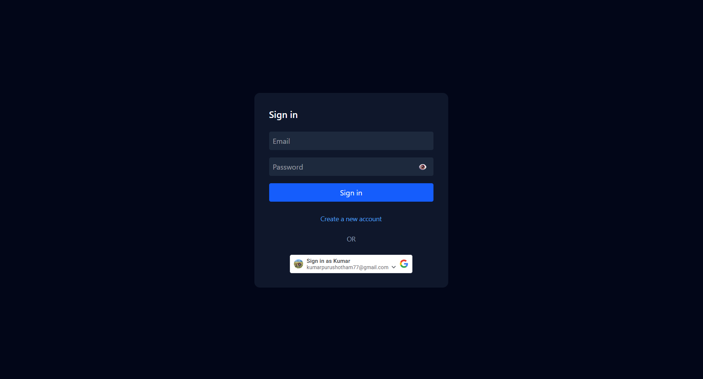
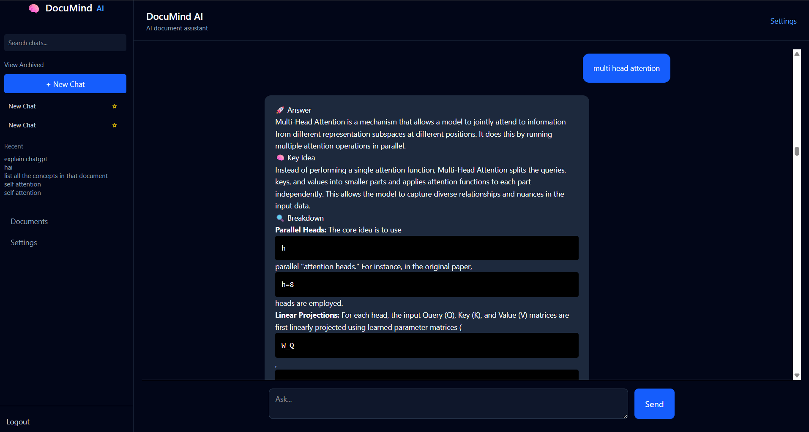

<h1 align="center">🧠 DocuMind AI</h1>

  <b>Agentic RAG System for Intelligent Document Conversations</b> 
  Transform static documents into interactive knowledge systems using Retrieval-Augmented Generation

  
  
  
  

 

  <i>A full-stack production-oriented AI system that enables contextual Q&A over documents with real-time streaming and secure authentication.</i>

 

<h2 align="center">🖥️ Application Preview</h2>

  

  <i>Secure authentication with email/password and Google login</i>

  

  <i>Main dashboard with chat interface and streaming responses</i>

 

 

<h2 align="center">⚡ Core Concept</h2>

Instead of directly querying an LLM, the system retrieves relevant document context first and then generates answers grounded in that data.

<b>Query → Retrieval → Context Injection → LLM → Streaming Response</b>

 

<h2 align="center">🧱 System Architecture</h2>

  

<pre>
┌──────────────────────────┐
│        React UI          │
│  (Chat + Streaming UX)   │
└────────────┬─────────────┘
             │
             ▼
┌──────────────────────────┐
│ Authentication Layer     │
│ JWT + HTTP-only Cookies  │
└────────────┬─────────────┘
             │
             ▼
┌──────────────────────────┐
│     FastAPI Backend      │
│  API + Business Logic    │
└────────────┬─────────────┘
             │
             ▼
┌──────────────────────────┐
│       RAG Pipeline       │
│                          │
│  • Document Ingestion    │
│  • Chunking              │
│  • Embeddings            │
│  • FAISS Vector Store    │
│  • Retrieval + Rerank    │
│  • Prompt Builder        │
└────────────┬─────────────┘
             │
             ▼
┌──────────────────────────┐
│      Gemini LLM API      │
│  Response Generation     │
└────────────┬─────────────┘
             │
             ▼
┌──────────────────────────┐
│  Streaming Response SSE  │
│   (Token-by-token UI)    │
└──────────────────────────┘
</pre>

 

<h2 align="center">🚀 Capabilities</h2>

• Upload documents (PDF, TXT, DOCX) 
• Perform semantic search using embeddings 
• Retrieve context-aware answers 
• Real-time streaming responses (ChatGPT-like UX) 
• Multi-session chat system 
• Secure authentication with cookies + CSRF protection

 

<h2 align="center">🧠 Engineering Depth</h2>

<b>Retrieval-Augmented Generation</b> 
Transforms documents into embeddings and retrieves top-k relevant chunks using FAISS for efficient semantic similarity search.

<b>Context-Aware Prompt Engineering</b> 
Constructs dynamic prompts using retrieved chunks to reduce hallucination and improve accuracy.

<b>Streaming Architecture (SSE)</b> 
Implements server-sent events to stream tokens progressively, improving perceived latency.

<b>Secure Authentication</b> 
JWT-based authentication using HTTP-only cookies with CSRF protection for secure cross-origin access.

<b>Fault-Tolerant LLM Integration</b> 
Handles rate limits using retry logic, exponential backoff, and graceful fallback messaging.

<b>Modular Backend Design</b> 
Decoupled services: ingestion, retrieval, LLM, and auth → scalable and maintainable.

 

<h2 align="center">🧪 Tech Stack</h2>

<pre>
Frontend   : React (Vite), TypeScript
Backend    : FastAPI, Python
Database   : PostgreSQL / Supabase
Vector DB  : FAISS
Embeddings : Sentence Transformers
LLM        : Google Gemini API
Deployment : Render + Vercel
</pre>

 

<h2 align="center">🔍 Execution Flow</h2>

1. User uploads document 
2. Backend chunks and embeds content 
3. Stores embeddings in FAISS 
4. User asks query 
5. System retrieves relevant chunks 
6. Builds structured prompt 
7. Sends to LLM 
8. Streams response back to UI

 

<h2 align="center">🛠️ Local Setup</h2>

<pre>
Backend:
cd backend
pip install -r requirements.txt
uvicorn main:app --reload

.env:
DATABASE_URL=your_db_url
SECRET_KEY=your_secret
GEMINI_API_KEY=your_api_key
GOOGLE_CLIENT_ID=your_google_client_id

Frontend:
cd frontend
npm install
npm run dev
</pre>

 

<h2 align="center">🌐 Deployment</h2>

Backend → Render 
Frontend → Vercel

 

<h2 align="center">⚠️ Real-World Problems Solved</h2>

• LLM API rate limits and quota handling 
• Streaming failures and fallback responses 
• Secure cookie-based auth across domains 
• Retrieval vs latency trade-offs

 

<h2 align="center">🎯 Why This Project Stands Out</h2>

This is not just a chatbot. It demonstrates: 
• End-to-end system design 
• Production-ready backend architecture 
• Real-world LLM integration challenges 
• Scalable AI application patterns

 

<h2 align="center">👨‍💻 Author</h2>

Kumar Purushotham

 

⭐ Star this repository if you found it useful!

